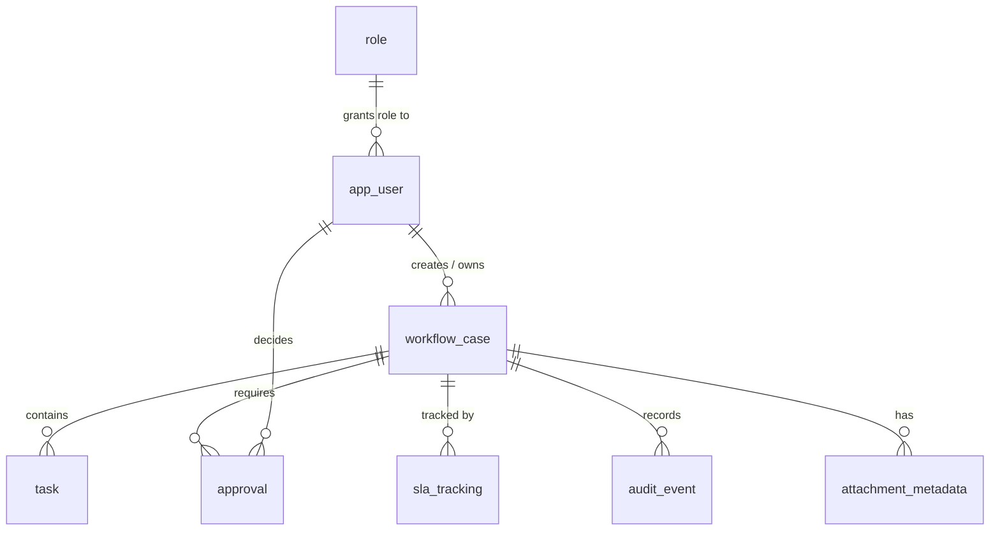

# Banking Workflow Reference

A **generic, educational PostgreSQL reference schema** for an enterprise
case-management workflow: cases, tasks, approvals, SLA tracking, an append-only
audit trail, and attachment metadata — with the governance controls (stable
keys, segregation of duties, auditability) that regulated back-office processes
tend to need.

> **Disclaimer**
> This is a **fictional reference model**. It is **not a real bank schema**, copies
> no proprietary or internal logic, and contains only fictional seed data. Use it
> to learn or bootstrap, not as a description of any real institution.

## Problem

Teams building workflow applications repeatedly reinvent the same data model —
and repeatedly get the governance details wrong: mutable audit logs, approvals
without segregation of duties, status inferred from process position, binary
blobs stuffed into the transactional database. This reference captures a clean
baseline you can adapt.

## Scope

A normalized schema for PostgreSQL 13+ covering:

- **Cases** — the single source of truth for a unit of work
- **Tasks** — work items belonging to a case
- **Approvals** — decision steps with segregation of duties
- **SLA tracking** — targets, due times, and breach state
- **Audit events** — append-only, controlled-vocabulary actions
- **Attachment metadata** — pointers to an external store (no binaries)

Plus reporting **views** and fictional **seed data**.

## Architecture (ERD)



The full attribute-level ERD is in [`docs/erd.md`](docs/erd.md); the business
flow and governance rationale are in
[`docs/business-flow.md`](docs/business-flow.md). Definitions for the terms
used across the model are in [`docs/glossary.md`](docs/glossary.md).

## Quick start

Requires **PostgreSQL 13 or newer** (uses `GENERATED ... AS IDENTITY`, `jsonb`,
`uuid`, and enum types).

```bash
createdb workflow_demo

# 1. Schema (tables, types, indexes, trigger)
psql -d workflow_demo -f schema/01_schema.sql

# 2. Fictional seed data
psql -d workflow_demo -f schema/02_seed.sql

# 3. Reporting views
psql -d workflow_demo -f schema/03_views.sql
```

Then explore:

```sql
SELECT * FROM v_open_cases;
SELECT * FROM v_sla_breaches;
SELECT * FROM v_pending_approvals;
```

`01_schema.sql` is safe to re-run — it drops existing objects first.

## Folder structure

```
banking-workflow-reference/
├── README.md
├── LICENSE
├── .gitignore
├── schema/
│   ├── 01_schema.sql      # types, tables, indexes, trigger
│   ├── 02_seed.sql        # fictional seed data
│   └── 03_views.sql       # reporting views
└── docs/
    ├── erd.md             # attribute-level Mermaid ERD
    ├── business-flow.md   # lifecycle + governance principles
    └── glossary.md        # case-management domain definitions
```

## Design highlights

- **Stable business keys** (`case_reference`, `task_reference`) alongside surrogate
  identity primary keys.
- **Status as data** via enum columns that reports and access rules can filter on.
- **Segregation of duties** enforced by a check constraint on `approval`.
- **Append-only audit** with a `correlation_id` for end-to-end tracing.
- **Attachments by reference** — metadata and a `storage_uri` only, never blobs.

## Limitations

- Domain specifics (products, ledgers, KYC) are intentionally omitted — this is a
  workflow governance reference, not a complete banking data model.
- Enforcement of some rules (e.g. SLA state transitions) is left to the
  application layer; the schema provides the structure, not every business rule.
- Row-level security and encryption are out of scope for this reference.

## Roadmap

- [ ] Optional row-level security example for auditor read-only access
- [ ] A `pg_dump`-based migration/versioning example
- [ ] Sample analytical queries for operational dashboards

## License

Released under the [MIT License](LICENSE).
