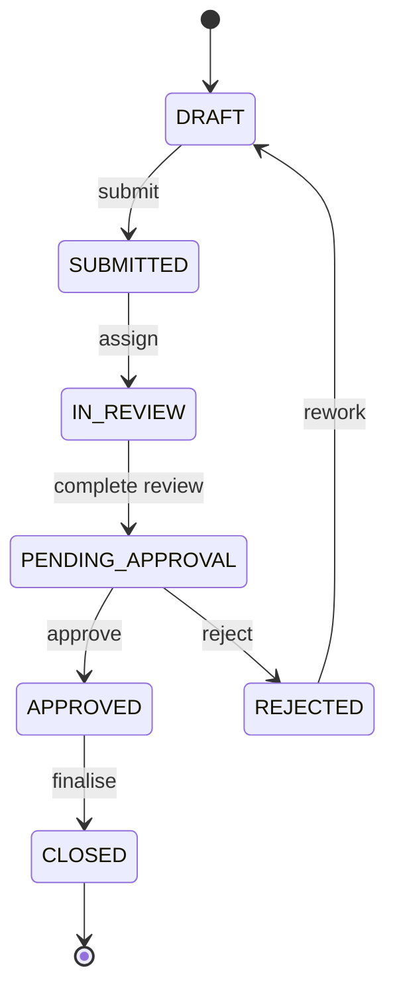

# Business Flow & Governance Principles

This reference models a generic **case-management workflow** of the kind found in
regulated back-office operations: a case is raised, worked through tasks,
approved under segregation of duties, tracked against SLAs, and fully audited.

## Lifecycle

## Governance principles baked into the schema

1. **Stable business keys.** Every case and task has an immutable
   `*_reference` that is safe to quote in correspondence and audits, separate
   from the surrogate primary key.

2. **Status is data.** `workflow_case.status` is an enumerated column that
   reports and access rules can filter on — the workflow state is never inferred
   from "where a process token happens to be."

3. **Segregation of duties.** The `approval` table records who decided and when,
   with a constraint that a non-pending decision must always have a decider and a
   timestamp. Approval authority is modelled separately from case editing.

4. **Append-only audit.** `audit_event` captures who did what to which case,
   when, with a controlled `action` vocabulary and a `correlation_id` that ties
   an action to the integrations it triggered. Rows are never updated in place.

5. **SLA transparency.** `sla_tracking` records the target, the due time, and the
   outcome state so breaches are queryable (`v_sla_breaches`) rather than
   discovered after the fact.

6. **Attachments by reference.** The database stores attachment **metadata and a
   storage pointer** only — never binary content — keeping the transactional
   store lean and the document store authoritative.

## Reporting views

| View                  | Answers the question…                     |
|-----------------------|-------------------------------------------|
| `v_open_cases`        | What work is still active, and who owns it?|
| `v_sla_breaches`      | Which cases have breached or overdue SLAs? |
| `v_pending_approvals` | What is waiting on an approver right now?   |

## Explicit non-goals

- This is **not** a real bank schema and copies no proprietary structures.
- It omits domain specifics (products, ledgers, KYC detail) on purpose — the
  point is the generic workflow governance pattern, not a particular business.
