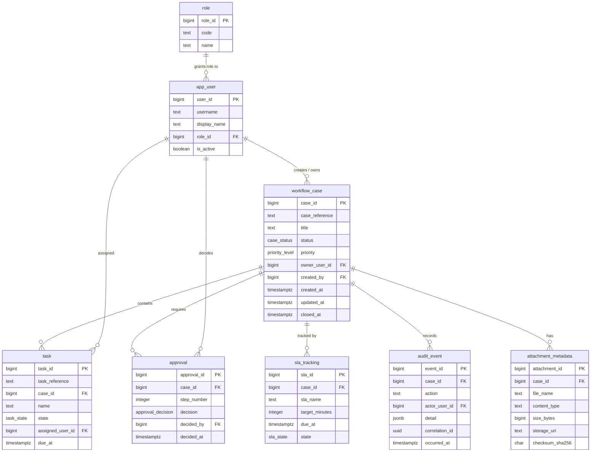

# Entity Relationship Diagram

Generic case-management workflow model. Render in any Mermaid-aware viewer
(including GitHub). This is a fictional reference model, not a real bank schema.

```mermaid
erDiagram
    role ||--o{ app_user : "grants role to"
    app_user ||--o{ workflow_case : "creates / owns"
    workflow_case ||--o{ task : "contains"
    workflow_case ||--o{ approval : "requires"
    workflow_case ||--o{ sla_tracking : "tracked by"
    workflow_case ||--o{ audit_event : "records"
    workflow_case ||--o{ attachment_metadata : "has"
    app_user ||--o{ approval : "decides"
    app_user ||--o{ task : "assigned"

    role {
        bigint role_id PK
        text   code
        text   name
    }
    app_user {
        bigint user_id PK
        text   username
        text   display_name
        bigint role_id FK
        boolean is_active
    }
    workflow_case {
        bigint      case_id PK
        text        case_reference
        text        title
        case_status status
        priority_level priority
        bigint      owner_user_id FK
        bigint      created_by FK
        timestamptz created_at
        timestamptz updated_at
        timestamptz closed_at
    }
    task {
        bigint     task_id PK
        text       task_reference
        bigint     case_id FK
        text       name
        task_state state
        bigint     assigned_user_id FK
        timestamptz due_at
    }
    approval {
        bigint            approval_id PK
        bigint            case_id FK
        integer           step_number
        approval_decision decision
        bigint            decided_by FK
        timestamptz       decided_at
    }
    sla_tracking {
        bigint      sla_id PK
        bigint      case_id FK
        text        sla_name
        integer     target_minutes
        timestamptz due_at
        sla_state   state
    }
    audit_event {
        bigint      event_id PK
        bigint      case_id FK
        text        action
        bigint      actor_user_id FK
        jsonb       detail
        uuid        correlation_id
        timestamptz occurred_at
    }
    attachment_metadata {
        bigint      attachment_id PK
        bigint      case_id FK
        text        file_name
        text        content_type
        bigint      size_bytes
        text        storage_uri
        char        checksum_sha256
    }
```
